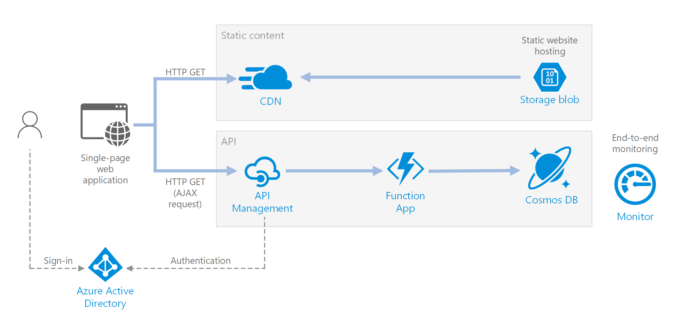

## Azure Serverless Workshop with Pulumi

The hands-on workshop will walk you through various tasks of managing Azure infrastructure with the focus on serverless compute and managed Azure services. All the resources are provisioned with [Pulumi](https://pulumi.com) and infrastructure-as-code.

You will be building an end-to-end Drone Delivery application that is based on two [reference architectures](https://github.com/mspnp/serverless-reference-implementation) defined by Microsoft.

### Drone Delivery Serverless

The project consists of two parts: a web front-end and a data processing pipeline.

#### Serverless web application

The application serves static content from Azure Blob Storage, and implements an API using Azure Functions. The API reads data from Cosmos DB and returns the results to the web app.

#### Serverless event processing

The application ingests a stream of data, processes the data, and writes the results to a back-end database (Cosmos DB).

### Prerequisities

Before proceeding, ensure your machine is ready to go:

- [Installing Prerequisites](00-installing-prerequisites.md)

### Lab 1 — Modern Infrastructure as Code

The first lab takes you on a tour of infrastructure as code concepts:

1. [Creating a New Project](./01-iac/01-creating-a-new-project.md)
2. [Configuring Azure](./01-iac/02-configuring-azure.md)
3. [Provisioning Infrastructure](./01-iac/03-provisioning-infrastructure.md)
4. [Updating your Infrastructure](./01-iac/04-updating-your-infrastructure.md)
5. [Making Your Stack Configurable](./01-iac/05-making-your-stack-configurable.md)
6. [Creating a Second Stack](./01-iac/06-creating-a-second-stack.md)
7. [Destroying Your Infrastructure](./01-iac/07-destroying-your-infrastructure.md)

[Get Started with Lab 1](./01-iac/01-creating-a-new-project.md)

### Lab 2 - Deploy Serverless Applications with Azure Functions

In this lab, you deploy a Azure Function Apps with HTTP-triggered serverless functions.

[Get Started with Lab 2](./02-serverless/README.md)

### Lab 3 - Deploy a Data Processing Pipeline

In this lab, you deploy a Azure Function Apps that is triggered by messages in an Event Hub. The device data from the messages are saved to Azure Cosmos DB. You setup a dead-letter queue for messages that failed to be processed and Azure Application Insights for monitoring.

[Get Started with Lab 3](./03-telemetry/README.md)

### Lab 4 - Deploy a Status Function App

In this lab, you deploy a Azure Function Apps that retrieves data from the Cosmos DB collection. That's the first step to building a web application that shows drone data to end users.

[Get Started with Lab 4](./04-status/README.md)

### Lab 5 - Deploy a Static Website

In this lab, you add an HTML frontend application that displays drone status data. You deploy a static website to a new Storage Account, including the HTML and JavaScipt files.

[Get Started with Lab 5](./05-frontend/README.md)

### Lab 6 - Deploy Azure API Management

In this lab, you add an API Management service in front of the Azure Function. You change the website to talk to that API Management service.

[Get Started with Lab 6](./06-api/README.md)

### Lab 7 - Deploy the Website Behind Azure CDN

In this lab, you add an Azure CDN service in front of the Storage Account.

[Get Started with Lab 7](./07-cdn/README.md)

### Lab 8 - Enable User Authentication

In this lab, you enable Azure Active Directory OAuth2 authentication in the status website.

[Get Started with Lab 8](./08-aad/README.md)